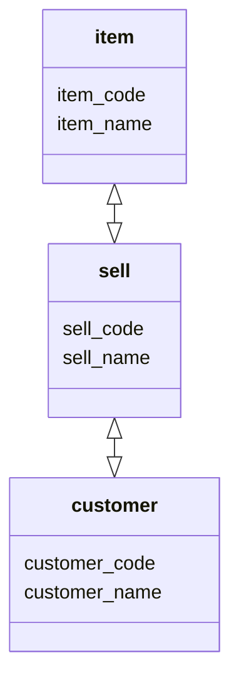
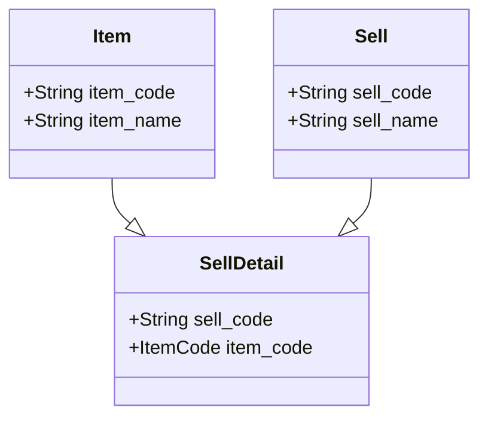

# OSS-DB Silver

## Section 1

### PostgreSQL

- History
  - POSTGRES (1986)
  - Postgres95 (1995)
  - PostgreSQL 6.0 (1996)
  - PostgreSQL 11 (2018)

- Licence
  - PostgreSQL: BSDライセンス

- version
  - naming convension
    x.y.z (x.y: MajorVersion, z: MinorVersion)

  - version ~10
    - x.y.x

  - version 10~
    - x.z

## Section 2

### DBMS: DataBase Management System

isolated between Application and DB data

- DBMS System
  - 機密保護
    データのアクセス権限を管理し、データの適切な機密保護を実現する

  - トランザクションを制御
    分割できない1つのまとまった処理
    DBMSは、トランザクション処理が途中で停止することないように制御する

  - データの整合性を維持
  - 障害からの安全復旧

### Data Model

- データモデル
  - データベースを構築する範囲を `対象世界`
  - 対象世界をモデル化したものが `データモデル`
  - データモデルを作成することを `データモデリング`

[対象世界] -> 抽象化 -> [概念データモデル] -> 変換 -> [論理データモデル]

### 概念データモデル

対象世界を抽象化して、対象世界のデータ構造を概念的に捉えた結果を表現したモデル
ERモデル -> Entity(実体), Relationship(関連)

Entity: 管理対象とするデータの集合体
Relationship: Entity間のつながり
Cardinality: Entity間における関係の多重度
あるEntityが保持する1件のデータが
対応関係にあるEntityの何件のデータに対応するかを意味する

[売上] <- (1 : 1) -> [出荷] (OneToOne)
[部門] <- (1 : n) -> [社員] (ForeignKey)
[製品] <- (n : n) -> [部品] (ManyToMany)

### 倫理データモデル

階層モデル(Tree）
ネットワークモデル(Graph）
関係モデル(Table)

### SQL 分類

ANSI : American National Standars Institute
ISO  : International Standars Organization

SQL: SQL86, SQL92, SQL99 複数の規格

- DDL: Data Definition Language
  - テーブルやインデックスの作成・変更・削除などを行う
  - CREATE, ALTER, DROP

- DML: Data Manipulation Language
  - データの参照・更新・追加・削除などを行う
  - SELECT, INSERT, UPDATE, DELETE
  
- DCL: Data Control Language
  - 権限の設定・取消・データの更新・確定・取消
  - GRANT, REVOKE, COMMIT, ROLLBACK

### データベース設計

1. 概念データモデル
2. DBMSに合わせて論理データモデルに変換する

### 正規化
