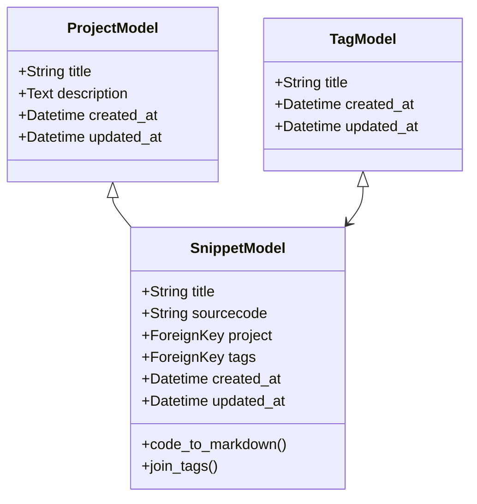

# test

- これはMarkdownです

## class Diagram

```mermaid
classDiagram
    ProjectModel <|--  SnippetModel 
    TagModel     <|--> SnippetModel 

    class SnippetModel {
        +String title
        +String sourcecode 
        +ForeignKey project
        +ForeignKey tags
        +Datetime created_at
        +Datetime updated_at

        +code_to_markdown()
        +join_tags()
    }

    class ProjectModel {
        +String title
        +Text description
        +Datetime created_at
        +Datetime updated_at
    }

    class TagModel {
        +String title
        +Datetime created_at
        +Datetime updated_at
    }
```